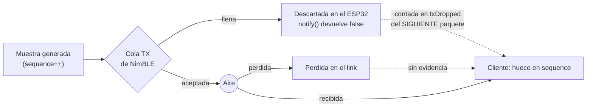

# PLAN — Protocolo VBT v2: el paquete que el filtrado necesita

> Documento de implementación. Mismo rol que `clients/mobile/PLAN.md` y
> `clients/desktop/PLAN.md`: las decisiones ya están argumentadas acá, el código las
> implementa sin re-discutirlas.
>
> Referencias: `firmware/src/main.cpp`, `clients/desktop/{protocol,dsp,app,test_dsp}.py`,
> `clients/mobile/src/protocol.ts`.

---

## 0. Contexto

`clients/desktop/PLAN.md` construyó un osciloscopio para responder una sola pregunta:
**qué filtro se implementa en el microcontrolador.** La herramienta está construida y funciona.
Pero su propio §10 se cierra reconociendo un techo que ningún cliente puede levantar:

> *"El paquete v1 no lleva giroscopio, y eso pone un techo a lo que cualquier filtro puede
> lograr. (…) El MPU6050 ya tiene el giro configurado y ya se lee en cada `mpu.getEvent()` —
> los datos existen y se descartan."*

Este plan levanta ese techo. Pero la auditoría del firmware encontró que el giroscopio no es
el único dato que se está tirando, y **ni siquiera es el problema más grave**. Hay tres cosas
que el firmware sabe en el momento de muestrear, que nadie más puede reconstruir después, y
que hoy no se transmiten:

1. **Cuándo muestreó de verdad** (hoy el timestamp miente sobre esto).
2. **Si la lectura del sensor falló** (hoy los errores de I²C se envían como datos válidos).
3. **Si el notify se perdió dentro del ESP32 o en el aire** (hoy son indistinguibles).

El objetivo de este plan es que el paquete v2 transporte **todo lo que el firmware sabe y el
cliente no puede deducir**. Nada más que eso: no hay algoritmos nuevos acá.

**El entregable es un paquete honesto, no un filtro.** La fusión de orientación
(Madgwick / complementario), que es lo que finalmente va a *consumir* el giroscopio, es un
plan aparte — ver §9. Este plan se considera terminado cuando los datos nuevos están en
pantalla y **verificados**, no cuando se usan.

---

## 1. Hallazgos de la auditoría

Todo lo que sigue está verificado contra el código instalado, no contra documentación.

### 1.1 El timestamp no significa lo que el cliente cree que significa

`clients/desktop/dsp.py:42-52`, el docstring de `to_grid`, afirma:

> *"every timestamp it emits is an exact multiple of the sample interval since boot"*

Sobre esa afirmación se apoya **toda** la reconstrucción de grilla uniforme, y por lo tanto la
validez de Butterworth, Welch y Savitzky-Golay (`PLAN.md §5.1`: *"Esto es lo que legitima usar
Butterworth de coeficientes fijos…"*).

**Es falsa.** El scheduler sí es libre de drift:

```
541|        lastSampleTime += SAMPLE_INTERVAL_US;
```

…pero `lastSampleTime` **nunca se transmite**. Lo que se transmite es otra cosa:

```
331|    packet.timestamp = micros();
```

Y ese `micros()` se lee en `createPacket()` **después** de que `mpu.getEvent()` (`main.cpp:310`)
terminó su transacción de I²C. O sea: el timestamp emitido es el momento en que la lectura
*terminó*, contaminado con toda la latencia y el jitter del bus y del loop.

Cuánto: `Wire.begin(SDA_PIN, SCL_PIN)` (`main.cpp:163`) usa la sobrecarga
`begin(int sda, int scl, uint32_t frequency = 0)`, y el HAL de ESP32 traduce `frequency == 0`
a **100 kHz**. La transacción es de 14 bytes en ráfaga (`Adafruit_MPU6050.cpp:643-654`) más
direccionamiento, ~17 bytes × 9 bits ≈ **1,5 ms** — el 15 % de un intervalo de 10 ms.

El dato clave es que **el firmware conoce las dos cosas** (la hora agendada y la real) y hoy no
manda ninguna de las dos de forma utilizable. Mandar ambas convierte la afirmación de §5.1 de
un supuesto en una medición.

### 1.2 Giroscopio y temperatura ya se leen y se tiran

`Adafruit_MPU6050::_read()` hace **una sola** lectura en ráfaga de 14 bytes:

```
643|  uint8_t buffer[14];
646|  rawAccX  = buffer[0] << 8 | buffer[1];     // 6 bytes de acelerómetro
650|  rawTemp  = buffer[6] << 8 | buffer[7];     // 2 bytes de temperatura
652|  rawGyroX = buffer[8] << 8 | buffer[9];     // 6 bytes de giroscopio
```

`createPacket()` declara los tres eventos, se los pasa a `getEvent()`, y usa uno:

```
304|    sensors_event_t acceleration;
305|    sensors_event_t gyro;           // ← se llena y se descarta
306|    sensors_event_t temperature;    // ← se llena y se descarta
```

**Agregar giro y temperatura al paquete cuesta 0 µs de I²C y 0 ciclos de CPU.** El único costo
es en bytes de BLE. Esto invalida cualquier discusión sobre si "vale la pena" leerlos: ya se
están leyendo, y pagando.

Por qué la temperatura importa y no es relleno: el error dominante en la doble integración es
el bias DC (`clients/desktop/PLAN.md §8.3`), y el bias del MPU6050 **deriva con la
temperatura**. El chip se auto-calienta varios grados en los primeros minutos de sesión.
Registrar la temperatura es lo que permite que la herramienta desktop *mida* esa correlación
en vez de especular con ella.

### 1.3 Los errores de I²C se transmiten como datos válidos

`mpu.getEvent()` devuelve `bool`. En `main.cpp:310` el valor de retorno **se descarta**.

Si la lectura falla, los `sensors_event_t` conservan su contenido anterior, y ese contenido se
empaqueta con un `timestamp` fresco y un `sequence` nuevo. Para el cliente es indistinguible de
una muestra real.

`clients/desktop/PLAN.md §8.4` plantea como hipótesis que haya *"glitches de I²C"* produciendo
spikes impulsivos, y propone la mediana (#7) como el único filtro que los mata. **Hoy esa
hipótesis no se puede ni confirmar ni refutar**, porque el firmware borra la evidencia. Un bit
la vuelve decidible.

### 1.4 Los notifies perdidos son invisibles, y el link no está negociado

Tres problemas encadenados:

- `pCharacteristic->notify()` (`main.cpp:386`) devuelve `bool` — verificado en
  `NimBLECharacteristic.h:61`. Se descarta. Cuando la cola de TX de NimBLE se llena, el paquete
  desaparece en silencio.
- **No se negocian parámetros de conexión.** No hay `setPreferredParams` ni `updateConnParams`
  en ninguna parte. El intervalo de conexión por defecto que imponen Android y macOS suele
  quedar en 30-50 ms; a 100 Hz eso son 3-5 notifies que hay que encolar por evento de conexión.
- **No se pide MTU.** No hay `NimBLEDevice::setMTU()`. El cliente móvil pide 247
  (`clients/mobile/src/ble.ts:13`) y el firmware acepta lo que venga.

Esto explica directamente la observación de `clients/desktop/PLAN.md §4`: *"Los notifies llegan
en ráfagas: macOS agrupa varios paquetes por connection event."* Es real, y es consecuencia de
no haber pedido un intervalo corto.

La consecuencia de diseño importante: el cliente ve un hueco en `sequence` y **no puede saber
si el paquete murió en el ESP32 o en el aire**. Los dos contadores de Hz del desktop (§6 de su
plan) fueron diseñados para separar "problema del sensor" de "problema del link" — pero no
alcanzan a separar "cola del firmware" de "link". Un byte sí.



Con `txDropped`, un hueco de N muestras acompañado de `txDropped == N` es backpressure del
firmware; un hueco de N con `txDropped == 0` se perdió en el aire. Son dos problemas distintos
con dos soluciones distintas, y hoy se ven igual.

### 1.5 El clipping de ±8 g es indetectable

`MPU6050_RANGE_8_G` (`main.cpp:194`) da un fondo de escala de ±8 g = **±78,45 m/s²**. El golpe
del rack o una descarga de la barra pueden saturar el sensor. Una muestra saturada es un
recorte duro, y `clients/desktop/PLAN.md §8.4` tiene razón en que ningún pasa-bajos lo arregla:
lo *esparce*. Pero hoy una muestra en el riel se ve exactamente igual que una lectura grande
legítima.

### 1.6 Bug aparte: el ESP32 deja de anunciarse tras la primera desconexión

Encontrado mientras se verificaba la API de NimBLE, no relacionado con el paquete, pero en el
camino y barato:

```
NimBLEServer.cpp:58|      m_advertiseOnDisconnect{false},
NimBLEServer.cpp:509|            if (pServer->m_advertiseOnDisconnect) {
NimBLEServer.cpp:510|                pServer->startAdvertising();
```

El valor por defecto es **false**, y nada en `main.cpp` llama a `advertiseOnDisconnect(true)`.
`pAdvertising->start()` se llama una única vez en `setupBLE()` (`main.cpp:277`). Resultado:
**cuando el cliente se desconecta, el sensor deja de ser visible hasta un power-cycle.**

Esto castiga exactamente el ciclo de trabajo que la herramienta desktop vino a habilitar
(conectar, capturar 20 s, desconectar, cambiar filtro, repetir). Se arregla con una línea, y
como este plan ya agrega `NimBLEServerCallbacks` por §1.4, no cuesta ni siquiera eso.

---

## 2. Decisiones tomadas

| Decisión | Elegido | Por qué |
|---|---|---|
| Versionado | v2 **reemplaza** a v1 en el firmware; el desktop despacha por byte de versión | Un firmware que emite dos formatos es un firmware con dos caminos que mantener y un modo que nadie prueba |
| Contenido | accel + **gyro** + **temp** + **flags** + **diagnóstico de tiempo** | Todo lo que el firmware sabe y el cliente no puede deducir. Nada más |
| Codificación | `float32` para todos los canales físicos | Ver abajo |
| Batching | **No.** 1 muestra por notify | Ver abajo |
| Configuración en caliente | **No.** Constantes de compilación | Decidido con el usuario. Queda especificado como v3 en §9 |
| Fusión de orientación | **Fuera de alcance** | Es un cambio de algoritmo, no de protocolo. Plan aparte |
| Timestamp | Hora **agendada** + jitter medido, no `micros()` crudo | §3.2 |

**Por qué `float32` y no `int16` crudo con cabecera de escala.** La codificación cruda es más
densa (12 bytes en vez de 24 para accel+gyro) y es la respuesta correcta *si se batchea*. No
batcheamos. A 42 bytes × 100 Hz son **4,2 kB/s**, holgadísimo. Y el driver de Adafruit ya
convierte a unidades físicas, así que mandar crudo obligaría a `protocol.py` y `protocol.ts` a
replicar el factor de escala y **mantenerlo sincronizado con el rango configurado** — una
fuente de bugs silenciosos a cambio de bytes que sobran. Se revisa cuando se suba la
frecuencia, no antes.

**Por qué no batchear.** A 100 Hz un notify de 42 bytes entra cómodo. Batchear cambia latencia
por throughput y **empeora la contabilidad de pérdidas**: se pierden N muestras por notify
caído en vez de 1. Se vuelve necesario arriba de ~200 Hz, que es territorio del experimento de
aliasing/DLPF que `clients/desktop/PLAN.md §10` declara explícitamente fuera de su alcance.
Especificado como v3 en §9.

### Consecuencia aceptada: esto rompe el cliente móvil

`clients/mobile/src/protocol.ts:34` rechaza cualquier paquete con `version !== 0x01`,
devolviendo `null`. Con firmware v2 la app móvil **deja de recibir datos** — no se degrada, se
queda en cero.

Fue una decisión explícita del usuario limitar el alcance a firmware + desktop. Se deja
anotado acá para que sea una decisión y no una sorpresa. El arreglo, cuando se quiera, es
chico y está descripto en §9.

---

## 3. El paquete v2

### 3.1 Layout

42 bytes, little-endian, `#pragma pack(1)`, igual que v1.

| Offset | Tam | Campo | Tipo | Notas |
|---|---|---|---|---|
| 0 | 1 | `magic` | uint8 | `0x56`, sin cambios |
| 1 | 1 | `version` | uint8 | **`0x02`** |
| 2 | 1 | `flags` | uint8 | Bitfield, §3.3 |
| 3 | 1 | `txDropped` | uint8 | Notifies caídos desde el último exitoso, satura en 255 |
| 4 | 4 | `timestamp` | uint32 | **Hora agendada** en µs desde boot, §3.2 |
| 8 | 4 | `sequence` | uint32 | Sin cambios de semántica |
| 12 | 2 | `jitterUs` | int16 | Desvío real vs agendado, §3.2 |
| 14 | 4 | `accelX` | float32 | m/s² |
| 18 | 4 | `accelY` | float32 | m/s² |
| 22 | 4 | `accelZ` | float32 | m/s² |
| 26 | 4 | `gyroX` | float32 | **rad/s** (lo que entrega `sensors_event_t`) |
| 30 | 4 | `gyroY` | float32 | rad/s |
| 34 | 4 | `gyroZ` | float32 | rad/s |
| 38 | 4 | `tempC` | float32 | °C |

```c
#pragma pack(push, 1)
struct VBTDataPacket {
    uint8_t  magic;
    uint8_t  version;
    uint8_t  flags;
    uint8_t  txDropped;
    uint32_t timestamp;
    uint32_t sequence;
    int16_t  jitterUs;
    float    accelX, accelY, accelZ;
    float    gyroX,  gyroY,  gyroZ;
    float    tempC;
};
#pragma pack(pop)

static_assert(sizeof(VBTDataPacket) == 42, "VBTDataPacket must be exactly 42 bytes");
```

Del lado Python, el espejo es una línea y su assert:

```python
PACKET_V2 = struct.Struct("<BBBBIIh7f")
assert PACKET_V2.size == 42
```

Los metadatos van **antes** de los floats a propósito: `magic`/`version` siguen en offset 0/1
para que el despacho por versión funcione leyendo dos bytes, sin importar cuánto crezca el
paquete después.

### 3.2 Semántica del tiempo — la parte que hay que leer con atención

Este es el cambio conceptual del plan; el giroscopio es solo el cambio más grande.

- **`timestamp` = la hora agendada**, o sea `lastSampleTime`, no `micros()`. Como el scheduler
  acumula (`lastSampleTime += SAMPLE_INTERVAL_US`), es exactamente
  `t0 + n · SAMPLE_INTERVAL_US`. **Ahora sí es verdad** lo que el docstring de `to_grid` ya
  afirmaba, y la grilla uniforme pasa a ser un hecho en vez de un supuesto.

- **`jitterUs` = `micros()` al terminar la lectura − `timestamp`.** Es lo que impide que el
  cambio anterior sea una mentira cómoda. Si el firmware se atrasa, un timestamp agendado lo
  ocultaría; `jitterUs` lo expone, muestra por muestra.

La pregunta que esto responde no es filosófica. Una grilla sintética sin medición de desvío es
*exactamente* el tipo de dato que se ve perfecto en pantalla y está mal. Con los dos campos, la
herramienta desktop puede reportar la mediana y el p95 de `|jitterUs|` y decidir con números si
la grilla es confiable.

**Incertidumbre residual, declarada:** aunque `jitterUs` fuera 0, la muestra que devuelve el
MPU6050 puede tener hasta 1 ms de antigüedad — `setSampleRateDivisor(0)`
(`Adafruit_MPU6050.cpp:113`) deja el ODR interno en 1 kHz y nosotros leemos a 100 Hz, así que
tomamos la última muestra que el chip tenga lista. Eso **no se puede medir desde el software**;
requiere cablear el pin INT (data-ready) del MPU6050. Anotado en §9. Lo importante es que 1 ms
es una cota conocida, no un error desconocido.

**Qué hacer con el jitter una vez medido:** nada, por ahora. `to_grid` sigue usando el
timestamp agendado, que es correcto por construcción. Si el p95 de la *dispersión* (no del
offset — un offset constante es un retardo puro y es irrelevante) resulta grande, el arreglo es
del lado del firmware (subir el reloj de I²C, sacar la lectura del camino que bloquea BLE),
**no** resamplear del lado del cliente. Primero medir.

### 3.3 El byte de flags

```c
#define VBT_FLAG_ACCEL_CLIPPED   0x01  // algún eje de accel en el riel de +-8 g
#define VBT_FLAG_GYRO_CLIPPED    0x02  // algún eje de giro en el riel de +-500 dps
#define VBT_FLAG_IMU_READ_FAILED 0x04  // mpu.getEvent() devolvio false: datos rancios
#define VBT_FLAG_SCHED_LATE      0x08  // jitter >= un intervalo completo
#define VBT_FLAG_SCHED_RESYNC    0x10  // se abandono la agenda, §4.8
// bits 5-7 reservados, siempre 0
```

Umbrales, al 99 % del riel porque el fondo de escala exacto depende del trim de sensibilidad
de cada unidad:

```c
#define ACCEL_CLIP_MS2   77.67f   // 0.99 * 8 g   * 9.80665
#define GYRO_CLIP_RADS    8.639f  // 0.99 * 500 dps en rad/s
```

`SCHED_RESYNC` es el único que es estrictamente redundante: el cliente podría inferirlo de un
salto de timestamp sin reinicio de `sequence`. Se incluye igual porque cuesta un bit y una
línea, y porque "el firmware abandonó su agenda" merece ser explícito y no deducido.

---

## 4. Cambios en `firmware/src/main.cpp`

### 4.1 Struct y versión

Reemplazar el struct de §3.1, subir `#define VBT_VERSION 0x02`, actualizar el `static_assert` a
42 y actualizar el bloque de comentario del layout (`main.cpp:90-105`). Actualizar también el
`Serial.println("Packet size: 22 bytes")` de `setup()` (`main.cpp:513`) — es exactamente el
tipo de mentira que después cuesta media hora.

### 4.2 Reloj de I²C a 400 kHz

```c
Wire.begin(SDA_PIN, SCL_PIN, 400000);
```

De ~1,5 ms a ~0,4 ms por muestra. No es una micro-optimización: es **más de un 10 % del
presupuesto de 10 ms** devuelto, y es la reducción de jitter más grande disponible por una
línea. El MPU6050 soporta 400 kHz (Fast Mode) por datasheet.

Verificación: el p95 de `jitterUs` tiene que bajar de forma medible entre antes y después. Es
el primer uso real del campo nuevo.

### 4.3 `createPacket()` toma la hora agendada

La firma cambia a `VBTDataPacket createPacket(uint32_t scheduledUs)`.

```c
VBTDataPacket packet;
packet.flags = 0;

sensors_event_t acceleration, gyro, temperature;

if (!mpu.getEvent(&acceleration, &gyro, &temperature)) {
    // Los sensors_event_t conservan lo anterior. Se envia igual, pero
    // marcado: un hueco en la secuencia mentiria sobre la cadencia, y
    // borrar la evidencia es lo que hacia v1.
    packet.flags |= VBT_FLAG_IMU_READ_FAILED;
}

packet.timestamp = scheduledUs;

// micros() - scheduledUs con los dos uint32 da el delta correcto aun con
// wrap; el cast a int32 lo vuelve signado. Saturar a int16: +-32,7 ms cubre
// todo lo que no sea un stall, y un stall ya prende SCHED_RESYNC.
int32_t jitter = (int32_t)(micros() - scheduledUs);
packet.jitterUs = (int16_t)constrain(jitter, -32768, 32767);
if (jitter >= (int32_t)SAMPLE_INTERVAL_US) {
    packet.flags |= VBT_FLAG_SCHED_LATE;
}
```

Después, los canales y la detección de riel:

```c
packet.accelX = acceleration.acceleration.x;  // idem Y, Z
packet.gyroX  = gyro.gyro.x;                  // idem Y, Z — rad/s
packet.tempC  = temperature.temperature;

if (fabsf(packet.accelX) >= ACCEL_CLIP_MS2 ||
    fabsf(packet.accelY) >= ACCEL_CLIP_MS2 ||
    fabsf(packet.accelZ) >= ACCEL_CLIP_MS2) {
    packet.flags |= VBT_FLAG_ACCEL_CLIPPED;
}
// idem para el giro con GYRO_CLIP_RADS y VBT_FLAG_GYRO_CLIPPED
```

### 4.4 Contador de notifies caídos

Archivo-scope, al lado de `sequenceNumber`:

```c
static uint8_t txDropped = 0;   // caidos desde el ultimo notify exitoso
```

El paquete lleva el pendiente **antes** de intentar enviarse; si este notify también falla, el
valor viaja en el siguiente que sí salga:

```c
packet.txDropped = txDropped;
```

Y en `sendBLEPacket()`:

```c
// Solo contar con un cliente conectado: sin suscriptores notify() no tiene
// a quien entregar, y contarlo como perdida saturaria el byte en 255
// durante la espera, falseando el primer paquete de cada sesion.
if (pServer->getConnectedCount() == 0) {
    return;
}

if (pCharacteristic->notify()) {
    txDropped = 0;
} else if (txDropped < 255) {
    txDropped++;
}
```

`txDropped` se pone en 0 también en `onConnect` (§4.5), por si quedó algo de la sesión anterior.

Esto requiere que `pServer` pase a ser file-scope; hoy es una local de `setupBLE()`
(`main.cpp:243`).

### 4.5 Parámetros de conexión, MTU y el bug de §1.6

Agregar la clase de callbacks (firmas verificadas en `NimBLEServer.h:159,169`):

```c
class VBTServerCallbacks : public NimBLEServerCallbacks {
    void onConnect(NimBLEServer* pServer, NimBLEConnInfo& connInfo) override {
        txDropped = 0;
        // 6..12 unidades de 1,25 ms = 7,5..15 ms. A 100 Hz y 15 ms hacen falta
        // 2 notifies por evento de conexion; NimBLE encola varios, asi que hay
        // margen. latency 0: nunca saltear un evento. timeout 400*10ms = 4 s.
        pServer->updateConnParams(connInfo.getConnHandle(), 6, 12, 0, 400);
    }
    void onDisconnect(NimBLEServer* pServer, NimBLEConnInfo& connInfo, int reason) override {
        Serial.printf("Client disconnected, reason=%d\n", reason);
    }
};
```

En `setupBLE()`:

```c
NimBLEDevice::setMTU(247);              // 42 bytes + 3 de ATT entran de sobra;
                                        // pedirlo evita depender del cliente
pServer->setCallbacks(new VBTServerCallbacks());
pServer->advertiseOnDisconnect(true);   // §1.6 — sin esto hace falta power-cycle
pAdvertising->setPreferredParams(6, 12);
```

`setPreferredParams` va en el advertising (es una *sugerencia* que viaja en el paquete de
anuncio) y `updateConnParams` en `onConnect` (es un *pedido* explícito post-conexión).
Los dos, porque los stacks de Android y macOS honran uno u otro según versión.

### 4.6 Guarda de resincronización del scheduler

El comentario de `main.cpp:82-87` ya identificó este peligro para el arranque y lo resolvió
sembrando `lastSampleTime` al final de `setup()`. La misma condición puede darse en caliente
(stall del stack BLE, cuelgue del bus I²C), y ahí no hay nadie sembrando nada:

```c
uint32_t now = micros();

if ((uint32_t)(now - lastSampleTime) >= SAMPLE_INTERVAL_US) {

    uint8_t resyncFlag = 0;

    // Si quedamos MUY atras, no disparar una rafaga de catch-up: saltar la
    // agenda a ahora y marcar la discontinuidad. El umbral es el mismo
    // DT_MAX_S = 0.25 s de clients/desktop/dsp.py:28, asi que las dos
    // puntas coinciden en que es "demasiado atras" y el cliente corta el
    // segmento en el mismo lugar donde el firmware lo corto.
    if ((uint32_t)(now - lastSampleTime) > MAX_CATCHUP_US) {
        lastSampleTime = now;
        resyncFlag = VBT_FLAG_SCHED_RESYNC;
    }

    uint32_t scheduledUs = lastSampleTime;
    lastSampleTime += SAMPLE_INTERVAL_US;

    VBTDataPacket packet = createPacket(scheduledUs);
    packet.flags |= resyncFlag;
    ...
}
```

Con `#define MAX_CATCHUP_US 250000`, y un comentario que apunte a `dsp.py:28` para que nadie
cambie uno sin el otro.

### 4.7 Debug por Serial

`printSerialPacket()` (`main.cpp:394-454`) imprime los 3 ejes de accel. Agregar giro,
temperatura y —solo cuando son distintos de cero— `flags`, `jitterUs` y `txDropped`.

**Cuidado con el presupuesto**: el comentario de `main.cpp:54-58` ya calculó que una línea
cuesta ~6,2 ms a 115200 baudios y que por eso existe `SERIAL_DEBUG_EVERY 50`. La línea nueva es
más larga. Mantener `SERIAL_DEBUG_EVERY` en 50 y **no** imprimir los campos de diagnóstico
cuando están en cero, que es el caso normal.

---

## 5. Cambios en el cliente desktop

Verificado: **no hay indexación posicional de `Sample` en ningún lado** del árbol de
`clients/desktop/`; todo el acceso es por nombre. Agregar campos al final del `NamedTuple` es
seguro.

### 5.1 `protocol.py`

- Renombrar `PACKET` → `PACKET_V1`, agregar `PACKET_V2 = struct.Struct("<BBBBIIh7f")` con su
  assert de 42.
- `_VBT_VERSION_V1 = 0x01`, `_VBT_VERSION_V2 = 0x02`.
- Extender `Sample` con campos nuevos **al final y con default**:

```python
class Sample(NamedTuple):
    timestamp: int
    ax: float
    ay: float
    az: float
    sequence: int
    rx_at: float
    raw: bytes
    gx: float = math.nan          # v1 y CSVs viejos no los traen: NaN, no 0.0 —
    gy: float = math.nan          # 0.0 es un valor de giro perfectamente valido
    gz: float = math.nan          # y se confundiria con "en reposo"
    temp_c: float = math.nan
    flags: int = 0
    tx_dropped: int = 0
    jitter_us: int = 0
```

  El default `nan` y no `0.0` es deliberado: "no hay dato" y "el sensor leyó cero" tienen que
  ser distinguibles, y en un giroscopio en reposo el valor real *es* casi cero.

- `parse_packet` despacha por versión: validar largo ≥ 2 y `data[0] == magic`, después mirar
  `data[1]` y elegir `PACKET_V1` / `PACKET_V2` (validando el largo exacto de cada una).
  Versión desconocida → `None`, como hoy.
- **Mantener el camino v1 funcionando.** No es cortesía con el firmware viejo: es lo que hace
  que las capturas CSV ya grabadas se sigan abriendo.
- Agregar las constantes `FLAG_*` y un `describe_flags(flags) -> str` que devuelva algo como
  `"CLIP|I2C"` para la vista de Stream.

### 5.2 `dsp.py`

- `Grid` gana `gx, gy, gz, temp_c, jitter_us`. `to_grid` los extrae e interpola igual que los
  de accel, con una guarda: **si el canal es todo NaN (datos v1), no interpolar, dejarlo NaN.**
  `np.interp` sobre NaN propaga basura silenciosa.
- **Corregir el docstring de `to_grid` (`dsp.py:42-52`).** Hoy afirma como hecho lo que §1.1
  demostró que era falso. Tiene que decir que el firmware v2 transmite la hora agendada y que
  `jitter_us` mide el desvío — que es lo que vuelve la afirmación verificable.
- Nueva aserción barata, ahora que es exigible: con v2,
  `timestamp == t0 + (seq - seq0) · round(1e6/fs)` exactamente. Si alguna vez falla, algo está
  muy mal. Vale un test (§6) más que una excepción en runtime.
- Nueva `timing_stats(grid) -> TimingStats` con mediana, p95 y máximo de `|jitter_us|` y la
  fracción de muestras con `SCHED_LATE`. **Esta función es el entregable de verificación de
  §3.2**: es la que dice si la grilla es confiable.
- `gyro_available(grid) -> bool`, o sea `not np.all(np.isnan(grid.gx))`, para que la UI sepa si
  tiene que mostrar los paneles de giro.

El banco de filtros, la integración, el PSD, el análisis de Winter y el exportador de C son
todos código 1D sobre `np.ndarray` — **no necesitan ningún cambio**. Los ejes de giro se les
pasan igual que los de accel.

### 5.3 `app.py`

- **CSV**: cabecera nueva
  `seq,t_us,ax,ay,az,gx,gy,gz,temp_c,flags,tx_dropped,jitter_us,rx_at_ms`.
- **`_load_csv` (`app.py:121-136`) tiene que tolerar las columnas faltantes.** Hoy usa
  `row["ax"]` directo, así que un CSV v1 explotaría con `KeyError`. Pasar a
  `float(row["gx"]) if "gx" in row else math.nan`. Esto no es defensa preventiva: ya pueden
  existir grabaciones v1 en `sessions/`, y el paso 9 de la verificación del plan desktop
  depende de poder reabrirlas.
- **Stream**: agregar giro y temperatura a la línea, y un marcador de flags cuando son
  distintos de cero (`[CLIP]`, `[I2C]`, `[LATE]`). Los flags son la razón principal por la que
  esta pestaña existe (`clients/desktop/PLAN.md §8.4`).
- **Barra de estado**: agregar p95 de jitter y los acumulados de muestras con clipping, con
  fallo de I²C y de `txDropped`. Son los tres números que dicen si la captura sirve.
- **Accel**: 3 gráficas más para el giro, con `setXLink` a las de accel y un checkbox
  "mostrar giro" para no saturar la pantalla por default.
- **Stats**: filas nuevas `gx/gy/gz/|ω|`.
- **Filters**: el combo de eje (`app.py:681-683`) gana `gx/gy/gz`.

Sin pestaña nueva. La fusión de orientación, que sí la justificaría, es §9.

---

## 6. Tests — `clients/desktop/test_dsp.py`

**Hay un test existente que este plan invalida y hay que cambiar:**

```
29|    bad_version = PACKET.pack(0x56, 0x02, 0, 0.0, 0.0, 0.0, 0)
30|    assert parse_packet(bad_version) is None, "wrong version must be rejected"
```

`0x02` ya no es una versión inválida. Reemplazarlo por un byte que siga sin serlo (`0x03`).

Tests a agregar, en el estilo de asserts planos del archivo:

1. **Round-trip v2** — `PACKET_V2.pack(...)` con valores conocidos, parsear, comparar los 14
   campos. Incluir un `jitterUs` **negativo** (muestra temprana), que es donde un `<h` mal
   escrito como `<H` se rompe y en ningún otro lado.
2. **`PACKET_V2.size == 42`** y que el largo equivocado se rechaza.
3. **v1 sigue parseando**, y devuelve `nan` en `gx/gy/gz/temp_c` — no `0.0`.
4. **Despacho de versión**: `0x03` → `None`; magic malo → `None`.
5. **`describe_flags`** con flags combinados.
6. **`to_grid` con giro**: los ejes de giro se interpolan en los mismos índices que los de
   accel.
7. **`to_grid` con giro todo-NaN** (camino v1 / CSV viejo): no explota y no inventa ceros.
8. **Coherencia timestamp/sequence** (§5.2): sobre muestras v2 sintéticas con huecos, verificar
   que `timestamp` reconstruye la grilla exactamente igual que `sequence`.

El #1 y el #7 son los que importan: el resto son barreras, esos dos son los modos de falla
reales de este cambio.

---

## 7. Orden de implementación

| # | Paso | Verificación |
|---|---|---|
| 1 | `protocol.py`: v2 + despacho por versión + `Sample` extendido | Tests 1-5 pasan, **sin hardware y sin tocar el firmware** |
| 2 | `main.cpp`: struct v2, `VBT_VERSION 0x02`, giro + temp + `tempC` | `pio run` compila; el `static_assert` de 42 pasa |
| 3 | `main.cpp`: I²C a 400 kHz, hora agendada + `jitterUs` | Serial muestra jitter chico y estable |
| 4 | `main.cpp`: flags (I²C, clipping, late, resync) | Golpear el sensor fuerte prende `ACCEL_CLIPPED` en Serial |
| 5 | `main.cpp`: `pServer` file-scope, callbacks, conn params, MTU, `advertiseOnDisconnect`, `txDropped` | Desconectar y reconectar **sin power-cycle** (§1.6) |
| 6 | `main.cpp`: guarda de resync + debug por Serial | Sesión de 2 min sin `SCHED_RESYNC` espurio |
| 7 | `dsp.py`: `Grid` + `to_grid` + `timing_stats` + docstring corregido | Tests 6-8 pasan |
| 8 | `app.py`: CSV, carga tolerante, Stream, barra de estado | Grabar, cerrar, reabrir: mismos números |
| 9 | `app.py`: gráficas de giro, Stats, combo de Filters | 6 gráficas enlazadas a 30 FPS sin lag |

El paso 1 va **antes** que el firmware a propósito: el cliente que sabe parsear v2 tiene que
existir antes que el firmware que lo emite, o el paso 2 se debuggea a ciegas. Los pasos 1 y 7-8
se verifican con paquetes sintéticos y CSVs, sin sensor.

---

## 8. Verificación de punta a punta

Con el ESP32 flasheado y la app corriendo:

1. **Conectar** — la barra muestra ~100 Hz en los dos contadores. **Desconectar y volver a
   conectar sin tocar el hardware**: tiene que funcionar (§1.6).
2. **Stream** — `seq` consecutivos, flags en cero, `jitterUs` chico y estable.
3. **Jitter, el número que justifica §4.2** — anotar el p95 de `|jitterUs|`. Con I²C a 400 kHz
   tiene que ser sensiblemente menor que a 100 kHz. Si no bajó, la hipótesis de §1.1 sobre de
   dónde venía el jitter estaba equivocada, **y eso también es un hallazgo** que hay que
   anotar en vez de tapar.
4. **Giro en reposo** — `|ω| ≈ 0`, con un bias por eje visible y constante de algunas
   centésimas de rad/s. Un bias nulo perfecto es sospechoso: significa que se está leyendo un
   struct en cero, no el sensor.
5. **Escala y signo del giro — la prueba que de verdad valida el campo.** Rotar la placa
   despacio exactamente 90° alrededor de un eje: `∫ω dt ≈ π/2 ≈ 1,571 rad`. Esto verifica de
   una sola vez el factor de escala, las unidades (rad/s y no °/s) y la convención de signo.
   Repetir por eje. **Sin este paso el giroscopio es solo tres curvas plausibles.**
6. **Temperatura** — cercana a la ambiente, subiendo unos grados en los primeros minutos por
   auto-calentamiento. Si marca 0 o −40, el offset del parser está corrido.
7. **Clipping** — un golpe seco prende `ACCEL_CLIPPED` y la pestaña Stream lo marca.
8. **`txDropped`** — durante una sesión limpia tiene que quedar en 0. Si aparece, los
   parámetros de conexión de §4.5 no fueron aceptados por el stack del host, y ahora se puede
   ver en vez de suponer.
9. **Grabar y reabrir** — CSV con las columnas nuevas; "Abrir…" da las mismas gráficas.
10. **Abrir un CSV v1 viejo** — carga sin error, con los paneles de giro vacíos y no en cero.

Los pasos 5 y 10 son los que se saltean por apuro y los que después cuestan una tarde.

---

## 9. Fuera de alcance (y por qué está acá anotado)

- **Fusión de orientación — Madgwick o filtro complementario.** Es *el* consumidor del
  giroscopio y la razón por la que existe este plan, pero es un cambio de algoritmo y va en su
  propio documento. Lo que lo habilita es el campo, y el campo lo entrega este plan.
  `clients/desktop/PLAN.md §5.2` ya lo rechazó explícitamente *"porque el paquete v1 no lleva
  giróscopo"* — esa objeción queda saldada acá.
- **Arreglar el cliente móvil.** `clients/mobile/src/protocol.ts` rechaza `version !== 0x01`
  (línea 34) y va a quedar sin datos. El arreglo es despachar por versión igual que
  `protocol.py`: una función de parseo más, sin refactor, porque `VbtSample` se extiende con
  campos opcionales y `vbt.ts` los ignora.
- **Batching (v3).** Un frame con N muestras por notify, en `int16` crudo con cabecera de
  escala. Se vuelve necesario arriba de ~200 Hz. Es el prerrequisito del experimento de
  aliasing/DLPF que `clients/desktop/PLAN.md §10` declara imposible hoy.
- **Característica de configuración en caliente.** Escribir banda del DLPF, ODR y rangos desde
  la app. Descartado por el usuario en este plan. Es lo que permitiría barrer los
  `MPU6050_BAND_*` sin reflashear.
- **Pin INT del MPU6050.** La única forma de eliminar el ±1 ms de incertidumbre de §3.2.
  Requiere cablear un GPIO, o sea es un cambio de hardware.
- **Filtrado en el micro.** El destino final del exportador de C de
  `clients/desktop/PLAN.md §5.6`. No se implementa hasta que la herramienta diga *cuál*, que
  es exactamente la decisión que este plan desbloquea.
